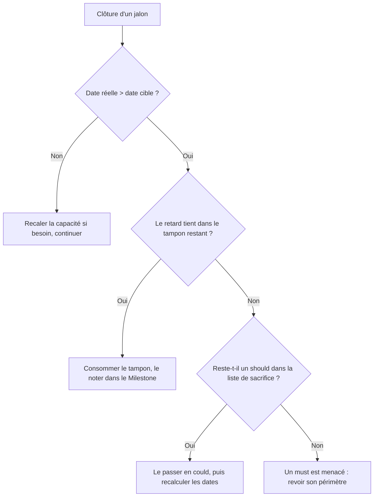

# Suivi de projet

## Méthode : Kanban + jalons

Flux continu, sans sprint : le rythme de travail est irrégulier (de plusieurs heures
par jour à plusieurs semaines sans activité), des itérations à durée fixe n'auraient
pas de sens. Le planning repose sur des **jalons** définis par une capacité
démontrable (« on peut faire une séance complète »), chacun avec une date cible
révisable. La clôture d'un jalon est le point de validation : voir
[Definition of Done](definition-of-done.md#jalon).

**Limite de WIP : 2** issues « En cours » au maximum, stories et technique confondues.

## Rôle des outils

| Outil | Contient |
|---|---|
| GitHub Project | Le kanban de toutes les issues |
| Issues `story` | La valeur utilisateur (« En tant que… ») |
| Autres issues | Le travail technique : dette, bugs, tâches |
| `GLOSSARY.md` | Le vocabulaire du domaine |
| `docs/adr/` | Le pourquoi des grandes décisions |

Une information n'est écrite qu'à un seul endroit ; les autres y renvoient.

## Structure GitHub

- **Identifiant** : le numéro d'issue.
- **Epics** : 7 issues `epic`, dont les stories sont des sous-issues.
- **Jalons** : Milestones J1 à J5, créés sans date.
- **MoSCoW** : labels, l'horizon étant la version jury.
- **Labels** : `story`, `epic`, `bug`, `tech-debt`, `security`, `must`, `should`, `could`, `wont`, `blocker-release`.
- **Colonnes** : Backlog / En cours / Terminé.
- **Champ** : « Estimation (j/h) ».
- **Vues** : Stories, Technique, Epics, Won't.
- **Stories `wont`** : elles restent ouvertes.

### Organisation des issues

- **Epic** : une issue `epic` par grand ensemble fonctionnel ; ses stories en sont
  les sous-issues (la barre de progression donne l'avancement par lot).
- **Story** : créée avec le modèle `story`. Rôles : uniquement User ou Guest
  (cf. glossaire). Les stories `must` et `should` ont leurs scénarios Gherkin
  complets ; les `could` et `wont` seulement leur phrase « En tant que… ».
- **Technique** : rattachée en sous-issue à la story qu'elle sert, sinon autonome.
- **Bug** : créé avec le modèle `bug`.
- **Jalon** : les issues techniques ont un jalon, comme les stories ; une sous-issue
  prend le jalon de sa story.
- **Ordre de tirage** :
  1. Les défauts hérités du jalon précédent (`bug` et `tech-debt`) sont tirés en premier.
  2. Un bug découvert pendant le jalon passe devant les stories.
  3. On tire la première carte du Backlog dont les dépendances sont terminées ;
     si elle est bloquée, la suivante.
  4. Les issues de la liste de sacrifice sont tirées en dernier,
     la première sacrifiée en tout dernier.
  Avant de tirer une nouvelle carte, regarder d'abord la vue Technique du jalon en cours.

### Labels

| Label | Sens |
|---|---|
| `story`, `epic` | Type d'issue |
| `bug`, `tech-debt`, `security` | Type de travail technique |
| `must`, `should`, `could`, `wont` | Priorité MoSCoW, jugée par rapport à la version présentée au jury |
| `blocker-release` | Bloquant pour la publication sur les stores (horizon distinct du jury) |

Un changement de priorité se fait en changeant le label : l'historique de l'issue
garde la trace datée de l'arbitrage. Les stories `wont` restent ouvertes.

### Colonnes

Backlog → En cours → Terminé. Une story passe en « Terminé » quand elle respecte
la [Definition of Done](definition-of-done.md#story).

### Jalons

Contenu, date cible et vérification iOS : voir la description de chaque
[Milestone](https://github.com/Blackers33/Fonderie/milestones).

Seules les stories `must` et `should` ont un jalon : c'est un engagement de livraison.
Les `could` attendent sans jalon et n'en reçoivent un que lors d'un arbitrage
(typiquement à la clôture d'un jalon, s'il reste de la capacité).

### Estimation

- Charge estimée par issue (stories **et** issues techniques ayant un jalon), champ
  « Estimation (j/h) » du Project. Chaque issue porte sa propre charge : celle d'une
  story n'inclut pas ses sous-issues.
- 1 j/h = 6 h de travail concentré. Échelle : 0,5 · 1 · 2 · 3 · 5.
  Au-delà de 5, l'issue est découpée.
- Estimation relative, étalonnée sur J1 (une story simple ≈ 0,5 j/h). Les petites
  issues techniques sont arrondies à 0,5 : surestimation assumée.
- La story qui crée un écran partagé (éditeur de routine, écran de séance, Réglages)
  en porte la conception ; les suivantes le réutilisent.

### Planning

- Capacité : 25 h/mois (≈ 4,2 j/h), justifiée par des jours alloués au projet
  (6 en octobre 2026). Recalée à chaque clôture de jalon.
- Date cible d'un jalon = cumul des charges ÷ capacité. Pas de marge par jalon :
  un tampon global de 15 % est placé avant J5.
- J5 : 1 mois de finitions, terminé au plus tard 2 semaines avant l'oral
  (1er septembre 2027).
- L'échéance du Milestone est la date cible actuelle, révisable ; la date cible
  initiale est figée dans sa description.

### Arbitrage

Appliqué à chaque clôture de jalon :

Liste de sacrifice, du premier au dernier : #30 + #62 · #31 · #26 + #6 · #46.
Les issues sacrifiables d'un jalon sont tirées en dernier.

### Format d'une story

- Un modèle Markdown : En tant que… / scénarios Gherkin cochables / Hors périmètre / Notes techniques / lien **absolu** vers la DoD.
- Les rôles sont uniquement User et Guest.
- Les `could` et les `wont` n'ont qu'une phrase. Les `must` et les `should` sont entièrement détaillées.
- Un modèle `bug` en 6 sections.

**Inventaire** : 43 stories, dont 22 `must`/`should` encore à faire, et 3 livrées en J1.

## Décisions produit prises au passage
*

- Pas d'unicité des noms de routine.
- Poids ≥ 0 en kg, virgule ou point acceptés.
- Une nouvelle série a reps et poids vides et un repos de `0:00`.
- Une seule séance en cours à la fois, reprise via un bandeau.
- Performances précédentes par exercice, en lecture seule.
- Les suppressions survivent au Restore.
- Le Backup n'envoie que les séances terminées ; le Restore n'a lieu qu'à la connexion.
- Déconnexion et suppression d'Account effacent l'appareil.
- Catalogue public, recherche insensible aux accents et bilingue.
- Exercice custom : nom et type obligatoires.
- L'onglet Explorer devient l'onglet Historique.
- Exercice custom : le type choisi est stocké comme un muscle représentatif.
- Performances précédentes : par exercice et numéro de série, même si l'exercice
  apparaît deux fois dans la séance.
